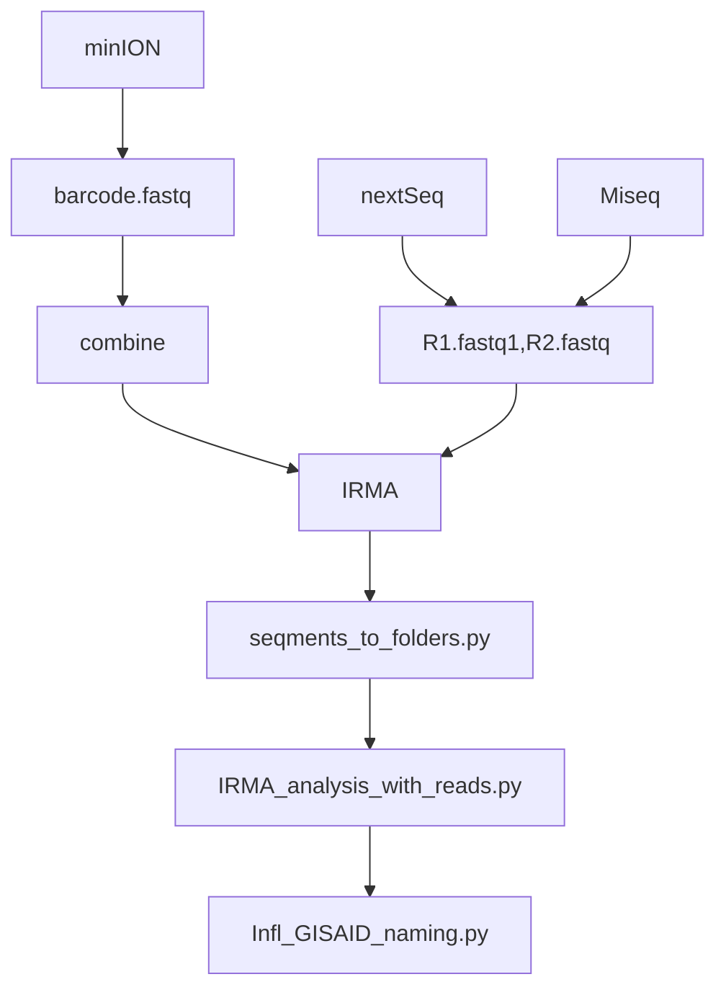

# Virus pipeline

Pipeline for viral sequencing data



## IRMA

Use the dockerfile to create container image

``` bash
docker build -t irma_thl .
```

Use the image to analyze the sample 
``` bash
docker run --rm -it \
    -v $(pwd):/data \
    irma_thl \
    IRMA FLU sample_R1_001.fastq.gz sample_R2_001.fastq.gz ./sample1
```
