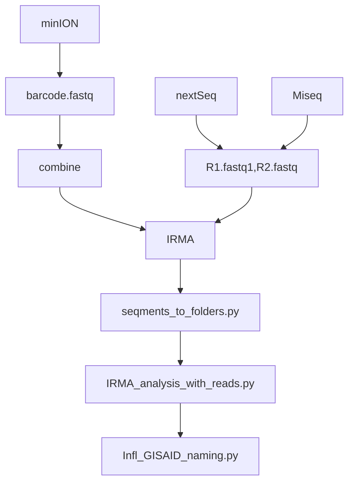

# Virus pipeline

Pipeline for viral sequencing data



## IRMA

Use the dockerfile to create container image

``` bash
docker build -t irma_thl .
```

Use the image to analyze the sample 
``` bash
docker run --rm -it \
    -v $(pwd):/data \
    irma_thl \
    IRMA FLU sample_R1_001.fastq.gz sample_R2_001.fastq.gz ./sample1
```

## Pipeline setup:

Currently the config file should have at minimum:

```python 

DATA_PATH = '/path/to/data'
RESULTS_PATH = DATA_PATH + '/results'
```
Currently the platform detection uses the DATA_PATH and folders in there named after platform used for example:

```bash

DATA_PATH
|
|---minion 
|---nextseq 
|---miseq
```

## Using the pipeline 

The watcher script is strated by using main.py
```bash
source .venv/bin/activate
python main.py
# or 
uv run main.py
```
